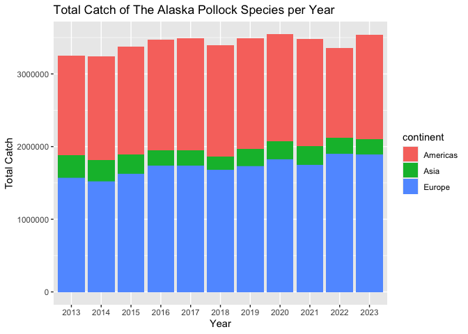
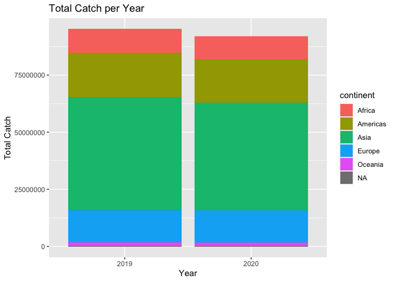

## Instructions
Answer the following questions and/or complete the exercises in RMarkdown. Please embed all of your code and push the final work to your repository. Your report should be organized, clean, and run free from errors. Remember, you must remove the `#` for any included code chunks to run.  

## Load the libraries

``` r
library("tidyverse")
library("janitor")
# library("naniar")
options(scipen = 999)
```

## About the Data
For this assignment we are going to work with a data set from the [United Nations Food and Agriculture Organization](https://www.fao.org/fishery/en/collection/capture) on world fisheries. These data were downloaded and cleaned using the `fisheries_clean.Rmd` script.  

Load the data `fisheries_clean.csv` as a new object titled `fisheries_clean`.

``` r
fisheries_clean <- read_csv("data/fisheries_clean.csv")
```

1. Explore the data. What are the names of the variables, what are the dimensions, are there any NA's, what are the classes of the variables, etc.? You may use the functions that you prefer.

``` r
glimpse(fisheries_clean)
```

```
## Rows: 1,055,015
## Columns: 9
## $ period          <dbl> 1950, 1951, 1952, 1953, 1954, 1955, 1956, 1957, 1958, …
## $ continent       <chr> "Asia", "Asia", "Asia", "Asia", "Asia", "Asia", "Asia"…
## $ geo_region      <chr> "Southern Asia", "Southern Asia", "Southern Asia", "So…
## $ country         <chr> "Afghanistan", "Afghanistan", "Afghanistan", "Afghanis…
## $ scientific_name <chr> "Osteichthyes", "Osteichthyes", "Osteichthyes", "Ostei…
## $ common_name     <chr> "Freshwater fishes NEI", "Freshwater fishes NEI", "Fre…
## $ taxonomic_code  <chr> "1990XXXXXXXX106", "1990XXXXXXXX106", "1990XXXXXXXX106…
## $ catch           <dbl> 100, 100, 100, 100, 100, 200, 200, 200, 200, 200, 200,…
## $ status          <chr> "A", "A", "A", "A", "A", "A", "A", "A", "A", "A", "A",…
```


``` r
names(fisheries_clean)
```

```
## [1] "period"          "continent"       "geo_region"      "country"        
## [5] "scientific_name" "common_name"     "taxonomic_code"  "catch"          
## [9] "status"
```


``` r
dim(fisheries_clean)
```

```
## [1] 1055015       9
```


2. Convert the following variables to factors: `period`, `continent`, `geo_region`, `country`, `scientific_name`, `common_name`, `taxonomic_code`, and `status`.

``` r
fisheries_clean <- fisheries_clean %>%
  mutate(across(c(period, continent, geo_region, country, scientific_name, common_name, taxonomic_code), as.factor))
fisheries_clean
```

```
## # A tibble: 1,055,015 × 9
##    period continent geo_region    country     scientific_name common_name       
##    <fct>  <fct>     <fct>         <fct>       <fct>           <fct>             
##  1 1950   Asia      Southern Asia Afghanistan Osteichthyes    Freshwater fishes…
##  2 1951   Asia      Southern Asia Afghanistan Osteichthyes    Freshwater fishes…
##  3 1952   Asia      Southern Asia Afghanistan Osteichthyes    Freshwater fishes…
##  4 1953   Asia      Southern Asia Afghanistan Osteichthyes    Freshwater fishes…
##  5 1954   Asia      Southern Asia Afghanistan Osteichthyes    Freshwater fishes…
##  6 1955   Asia      Southern Asia Afghanistan Osteichthyes    Freshwater fishes…
##  7 1956   Asia      Southern Asia Afghanistan Osteichthyes    Freshwater fishes…
##  8 1957   Asia      Southern Asia Afghanistan Osteichthyes    Freshwater fishes…
##  9 1958   Asia      Southern Asia Afghanistan Osteichthyes    Freshwater fishes…
## 10 1959   Asia      Southern Asia Afghanistan Osteichthyes    Freshwater fishes…
## # ℹ 1,055,005 more rows
## # ℹ 3 more variables: taxonomic_code <fct>, catch <dbl>, status <chr>
```

## 3. Are there any missing values in the data? If so, which variables contain missing values and how many are missing for each variable?

``` r
#Skip this problem for now.
```

4. How many countries are represented in the data?

``` r
fisheries_clean %>%
  summarize(n_country = n_distinct(country))
```

```
## # A tibble: 1 × 1
##   n_country
##       <int>
## 1       249
```

5. The variables `common_name` and `taxonomic_code` both refer to species. How many unique species are represented in the data based on each of these variables? Are the numbers the same or different?

``` r
fisheries_clean %>%
  group_by(common_name, taxonomic_code) %>%
  summarize(common_name, taxonomic_code, .groups = 'keep') %>%
  count(common_name) 
```

```
## Warning: Returning more (or less) than 1 row per `summarise()` group was deprecated in
## dplyr 1.1.0.
## ℹ Please use `reframe()` instead.
## ℹ When switching from `summarise()` to `reframe()`, remember that `reframe()`
##   always returns an ungrouped data frame and adjust accordingly.
## Call `lifecycle::last_lifecycle_warnings()` to see where this warning was
## generated.
```

```
## # A tibble: 3,722 × 3
## # Groups:   common_name, taxonomic_code [3,722]
##    common_name               taxonomic_code     n
##    <fct>                     <fct>          <int>
##  1 Aba                       117806101001      58
##  2 Abalones NEI              3701112010XX     763
##  3 Abu mullet                165001109001      13
##  4 Abyssal smooth-head       121514007801       2
##  5 Abyssal spiderfish        145504101403       3
##  6 Acadian redfish           172525111418      14
##  7 Acoupa weakfish           182006107401      73
##  8 Adriatic sole             155220107003       8
##  9 Aesop shrimp              228927103410     227
## 10 African armoured searobin 172520103401      12
## # ℹ 3,712 more rows
```

``` r
fisheries_clean %>%
  summarize(n_species = n_distinct(taxonomic_code))
```

```
## # A tibble: 1 × 1
##   n_species
##       <int>
## 1      3722
```


6. In 2023, what were the top five countries that had the highest overall catch?

``` r
fisheries_clean %>% #group by country because you use summarize later, take sum of the total catch for 7 (make a new column)
  filter(period == 2023) %>%
  group_by(country) %>%
  summarize(total_catch = sum(catch, na.rm = T)) %>%
  arrange(desc(total_catch)) %>%
  slice_max(total_catch, n = 5)
```

```
## # A tibble: 5 × 2
##   country                  total_catch
##   <fct>                          <dbl>
## 1 China                      13424705.
## 2 Indonesia                   7820833.
## 3 India                       6177985.
## 4 Russian Federation          5398032 
## 5 United States of America    4623694
```


7. In 2023, what were the top 10 most caught species? To keep things simple, assume `common_name` is sufficient to identify species. What does `NEI` stand for in some of the common names? How might this be concerning from a fisheries management perspective?

``` r
fisheries_clean %>%
  filter(period == 2023) %>%
  group_by(common_name) %>%
  summarize(total_catch = sum(catch, na.rm = T)) %>%
  arrange(desc(total_catch)) %>%
  slice_max(total_catch, n = 10)
```

```
## # A tibble: 10 × 2
##    common_name                    total_catch
##    <fct>                                <dbl>
##  1 Marine fishes NEI                 8553907.
##  2 Freshwater fishes NEI             5880104.
##  3 Alaska pollock(=Walleye poll.)    3543411.
##  4 Skipjack tuna                     2954736.
##  5 Anchoveta(=Peruvian anchovy)      2415709.
##  6 Blue whiting(=Poutassou)          1739484.
##  7 Pacific sardine                   1678237.
##  8 Yellowfin tuna                    1601369.
##  9 Atlantic herring                  1432807.
## 10 Scads NEI                         1344190.
```
NEI stands for "Not Elsewhere Included" (or Indicated), where catches are reported that they cannot be precisely identified at the species level (like the specific species beyond marine fishes nei for example cannot be identified). This is concerning from a fisheries management perspective because this tracking is important for maintaining the sustainability of the ecosystem/environment and knowing when to catch/not catch certain species. 

8. For the species that was caught the most above (not NEI), which country had the highest catch in 2023?

``` r
fisheries_clean %>%
  filter(period == 2023, common_name == "Alaska pollock(=Walleye poll.)") %>% #Alaska pollock is 3rd for all reported species, 1st of non NEI species reported 
  group_by(country) %>%
  summarize(total_catch = sum(catch, na.rm = T)) %>%
  arrange(desc(total_catch)) 
```

```
## # A tibble: 6 × 2
##   country                               total_catch
##   <fct>                                       <dbl>
## 1 Russian Federation                       1893924 
## 2 United States of America                 1433538 
## 3 Japan                                     122900 
## 4 Democratic People's Republic of Korea      58730 
## 5 Republic of Korea                          28432.
## 6 Canada                                      5887.
```
For the species that was caught the most above (Alaska pollock (Walleye poll.)), the country that had the highest catch in 2023 was the Russian Federation.

9. How has fishing of this species changed over the last decade (2013-2023)? Create a  plot showing total catch by year for this species.

``` r
fisheries_clean_walleyepoll <- fisheries_clean %>%
  filter(common_name == "Alaska pollock(=Walleye poll.)", period %in% c(2013:2023))
```


``` r
fisheries_clean_walleyepoll %>% 
  ggplot(mapping = aes(x = period, y = catch)) +
  geom_col(mapping = aes(fill = continent)) + 
  labs(title = "Total Catch of The Alaska Pollock Species per Year",
      x = "Year",
      y = "Total Catch") 
```

<!-- -->

10. Perform one exploratory analysis of your choice. Make sure to clearly state the question you are asking before writing any code.

The question I am asking is was there a difference that the COVID19 pandemic had on all catches in every continent? (more literally, is there a significant difference in catches for each continent between 2019 and 2020)

``` r
fisheries_clean %>% 
  filter(period == 2019 | period == 2020) %>%
  group_by(period, continent) %>%
  summarize(total_catch = sum(catch, na.rm = T)) %>%
  arrange(desc(total_catch)) 
```

```
## `summarise()` has grouped output by 'period'. You can override using the
## `.groups` argument.
```

```
## # A tibble: 12 × 3
## # Groups:   period [2]
##    period continent total_catch
##    <fct>  <fct>           <dbl>
##  1 2019   Asia        49320626.
##  2 2020   Asia        47105979.
##  3 2019   Americas    19478263.
##  4 2020   Americas    18991229.
##  5 2019   Europe      14151833.
##  6 2020   Europe      14132658.
##  7 2019   Africa      10452381.
##  8 2020   Africa      10021634.
##  9 2019   Oceania      1694218.
## 10 2020   Oceania      1566506.
## 11 2020   <NA>           51303.
## 12 2019   <NA>           50575.
```


``` r
fisheries_clean %>% 
  filter(period == 2019 | period == 2020) %>%
  ggplot(mapping = aes(x = period, y = catch)) +
  geom_col(mapping = aes(fill = continent)) + 
  labs(title = "Total Catch per Year",
      x = "Year",
      y = "Total Catch") 
```

<!-- -->

## Knit and Upload
Please knit your work as an .html file and upload to Canvas. Homework is due before the start of the next lab. No late work is accepted. Make sure to use the formatting conventions of RMarkdown to make your report neat and clean!  
